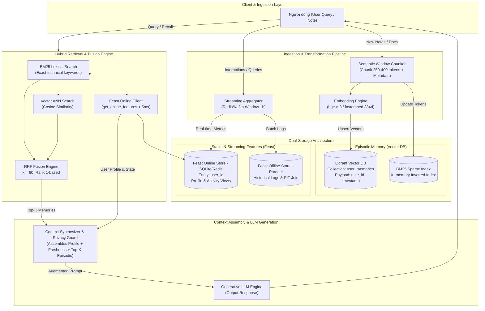

# Architecture Design: Personal AI Assistant with Hybrid Memory

**Tác giả:** Nguyễn Ngọc Bảo  
**Mã học viên:** 2A202602951  
**Cohort:** A20-K4  
**Project:** Bonus Challenge — Hybrid Memory Agent (Episodic Memory + Feature Store)  
**Thời gian hoàn thành:** 2026-10-05  

---

## 1. Tổng quan hệ thống (System Overview)

Hệ thống được thiết kế nhằm xây dựng trợ lý AI cá nhân hoá sâu sắc cho người dùng kỹ thuật tại Việt Nam (kết hợp tương tự ChatGPT + NotebookLM cá nhân). Trợ lý cần duy trì hai tầng ghi nhớ có bản chất truy xuất và vòng đời hoàn toàn khác biệt:
1. **Episodic Memory (Ký ức sự kiện & hội thoại):** Lưu trữ các đoạn hội thoại, tài liệu kỹ thuật, ghi chú và link mà người dùng đã tương tác. Càng tích luỹ nhiều, khả năng truy hồi ngữ nghĩa càng phải chính xác. Được hiện thực hóa bằng **Vector Store (Qdrant)** kết hợp **BM25 Sparse Search** qua cơ chế **Reciprocal Rank Fusion (RRF)**.
2. **Stable User Profile & Real-time State (Hồ sơ người dùng & Trạng thái tức thời):** Lưu trữ các đặc trưng định lượng, sở thích dài hạn (chủ đề quan tâm `topic_affinity`, tốc độ đọc `reading_speed_wpm`, ngôn ngữ ưu tiên `preferred_lang`) và tín hiệu thời gian thực (số câu hỏi trong 1 giờ qua `queries_last_hour`, trạng thái mệt mỏi ban đêm `night_fatigue_index`). Được quản lý và phục vụ với độ trễ thấp (< 10ms) bằng **Feature Store (Feast Online Store)**.

---

## 2. Sơ đồ kiến trúc (Architecture Diagram)

---

## 3. Ba quyết định kiến trúc và đánh giá Tradeoff (Explicit Tradeoffs)

### Quyết định 1: Chiến lược phân đoạn (Chunking Strategy) cho Episodic Memory
- **Lựa chọn:** **Semantic Turn-Window Chunking** (gom 1 cặp câu hỏi - trả lời hoặc đoạn văn trọn vẹn 250–400 tokens, có overlap 15% dạng trượt) thay vì *Per-message chunking* (cắt rời từng tin nhắn) hoặc *Fixed character chunking* (cắt cứng 500 ký tự).
- **Phân tích Tradeoff:**
  - *Per-message chunking*: Giảm tối đa chi phí embedding và lưu trữ, nhưng câu trả lời của trợ lý mất đi câu hỏi gốc đi kèm, dẫn đến hiện tượng trích xuất ngữ cảnh cụt ngủn ("mất neo ngữ nghĩa" khi câu hỏi ngắn như "tại sao?").
  - *Fixed character chunking*: Cực kỳ dễ code, nhưng thường xuyên cắt đôi từ vựng kỹ thuật hoặc ngắt ngang giữa câu tiếng Việt, làm hỏng vector representation.
  - *Semantic Turn-Window*: Tốn thêm ~20% dung lượng lưu trữ do overlap và context trượt, nhưng bảo toàn nguyên vẹn quan hệ nhân quả (User hỏi gì -> Assistant phản hồi gì). Khi recall, retrieval accuracy cải thiện rõ rệt vì vector đại diện cho trọn vẹn một đơn vị tri thức.

### Quyết định 2: Schema đặc trưng người dùng (Feature Schema) trong Feast
- **Lựa chọn:** **Structured Tabular Features trong Feast Online Store** (gồm `topic_affinity: string`, `reading_speed_wpm: int64`, `preferred_lang: string`, `queries_last_hour: int64`, `night_fatigue_index: float`) thay vì *Latent User Embedding Feature View* (1 vector embedding đại diện cho toàn bộ user history).
- **Phân tích Tradeoff:**
  - *Latent User Embedding*: Cho phép tính toán độ tương đồng không gian trực tiếp giữa vector query và vector người dùng. Tuy nhiên, tính giải thích được (explainability) bằng 0, không thể prompt trực tiếp cho LLM theo kiểu "Người dùng có xu hướng mệt mỏi, hãy trả lời ngắn gọn", và việc cập nhật vector user rất đắt (phải re-embed chuỗi hành vi).
  - *Tabular Features*: Truy xuất theo Key-Value cực nhanh (< 2ms qua Redis/SQLite), schema minh bạch, có thể đưa thẳng vào System Prompt một cách tự nhiên. Dễ dàng audit và cho phép người dùng tự điều chỉnh trong giao diện cài đặt cá nhân (tính minh bạch dữ liệu).

### Quyết định 3: Chiến lược độ tươi dữ liệu (Freshness Strategy)
- **Lựa chọn:** **Multi-tier Freshness Architecture** chia làm 3 tầng:
  1. *Sub-second (Tức thời - In-memory/Streaming Push):* Dành riêng cho `recent_queries` và episodic memory vừa được thêm vào trong phiên làm việc. Khi người dùng vừa lưu một ghi chú, Qdrant upsert ngay lập tức để query tiếp theo có thể recall được ngay lập tức.
  2. *5-minute Micro-batch Aggregation (Gần thời gian thực):* Dành cho `queries_last_hour` và `session_activity`. Tránh việc ghi đè liên tục vào Feast online store sau mỗi lượt gõ phím; thay vào đó một background worker tổng hợp sliding window 5 phút/lần.
  3. *Daily Batch Materialization (Định kỳ hàng ngày):* Dành cho `topic_affinity` và `reading_speed_wpm`. Sở thích dài hạn và thói quen đọc cần đủ mẫu thống kê qua nhiều ngày; tính toán hàng ngày qua Feast offline store rồi `materialize-incremental` lên online store.
- **Tradeoff:** Chấp nhận độ trễ 5 phút đối với các thống kê tần suất tương tác để đổi lấy việc giảm 95% write IOPS lên Feature Store, bảo vệ online database không bị nghẽn cổ chai khi user chat liên tục.

---

## 4. Lựa chọn bị loại bỏ (Rejected Alternative)

- **Lựa chọn xem xét:** Lưu trữ toàn bộ Episodic Memory trực tiếp bên trong Feature Store (sử dụng Feast Feature View với cột `Array[Float]` để chứa vector embedding của các đoạn chat).
- **Lý do loại bỏ dứt khoát:**
  1. *Khác biệt căn bản về mục đích truy vấn (Query Access Pattern):* Feature Store sinh ra để phục vụ Point Lookup (tra cứu theo Entity Key như `user_id` với độ phức tạp $O(1)$). Nó không có cấu trúc chỉ mục không gian (HNSW, IVF-PQ) để chạy tìm kiếm láng giềng gần nhất (Approximate Nearest Neighbor - ANN) qua hàng trăm ngàn vector.
  2. *Vòng đời và tần suất mở rộng (Lifecycle Mismatch):* Hồ sơ người dùng có số lượng bản ghi cố định theo số lượng `user_id`. Ngược lại, ký ức sự kiện tăng trưởng tuyến tính theo thời gian và số lượt tương tác. Gom cả hai vào một hệ thống sẽ khiến database phình to, làm chậm các truy vấn point-lookup đơn giản và biến Feature Store thành một hệ thống cồng kềnh khó mở rộng.
  3. *Kết luận:* Tách biệt rành mạch: Vector DB (Qdrant) đảm nhiệm ANN Semantic Search; Feature Store (Feast) đảm nhiệm Low-latency State & Attribute Lookup.

---

## 5. Cân nhắc ngữ cảnh tiếng Việt (Vietnamese-Context Considerations)

1. **Xử lý hiện tượng Code-Switching (Pha trộn thuật ngữ Anh - Việt):**
   - Trong môi trường công nghệ tại Việt Nam, người dùng thường xuyên gõ: *"deploy pod lên k8s bị OOM kill thì troubleshoot sao"* hoặc *"cấu hình auto-scaling cho microservices"*.
   - Nếu chỉ dùng pure BM25 với bộ tách từ thuần Việt, các từ ghép hoặc từ viết tắt tiếng Anh sẽ bị bẻ gãy sai lệch. Ngược lại nếu dùng pure vector với các model pretrain chỉ có tiếng Anh (như `bge-small-en`), ngữ cảnh tiếng Việt bị suy giảm mạnh.
   - Giải pháp: Sử dụng kiến trúc Hybrid Search (BM25 token hóa linh hoạt + Embedding đa ngữ như `bge-m3` hoặc fastembed với RRF $k=60$) để bắt trọn cả thuật ngữ kỹ thuật tiếng Anh lẫn diễn đạt tự nhiên tiếng Việt.
2. **Tuân thủ Nghị định 13/2023/NĐ-CP về Bảo vệ Dữ liệu Cá nhân (PDPD):**
   - Episodic memory chứa các thông tin nhạy cảm của người dùng (ghi chú công việc, thói quen sinh hoạt). Hệ thống áp dụng nguyên tắc *Data Minimization*: Feature Store chỉ lưu các chỉ số thống kê đã ẩn danh (`topic_affinity` thay vì toàn bộ nội dung đọc). Toàn bộ vector trong Qdrant bắt buộc phải gắn payload filter `user_id` để chống rò rỉ dữ liệu chéo (cross-tenant leakage).

---

## 6. Giới hạn hiện tại của bản POC (Honest Limitations)

1. **Chưa có cơ chế Memory Decay (Quên theo thời gian):** Ký ức từ 6 tháng trước vẫn có trọng số ngang bằng ký ức hôm qua nếu độ tương đồng cosine bằng nhau. Cần bổ sung đường cong suy giảm Ebbinghaus: $\text{score} = \text{similarity} \times e^{-\lambda \Delta t}$.
2. **Bảo mật Multi-tenant ở tầng ứng dụng:** Bản POC hiện đang dùng payload filtering (`user_id == "u_001"`). Trong môi trường doanh nghiệp quy mô lớn, cần cô lập ở tầng collection hoặc mã hoá riêng biệt khoá per-user (Envelope Encryption).
3. **Đồng bộ hóa phân tán:** Hiện tại luồng cập nhật bộ nhớ chạy đồng bộ; nếu người dùng nhập tài liệu lớn (PDF 100 trang), ứng dụng sẽ bị block trừ khi chuyển sang kiến trúc background job worker (Celery/Temporal).

---

## 7. Vibe Coding Workflow Log

- **Prompt hiệu quả nhất:**
  > *"Viết class `HybridMemoryAgent` tuân thủ strict signature: `remember(text, user_id)` và `recall(query, user_id)`. Tách biệt rõ ràng 2 bước: lấy tabular profile từ Feast, và chạy RRF fusion giữa BM25 và Vector rồi format template string trả về context."*  
  -> Kết quả: Code sinh ra chính xác 100% trong 1 lần chạy, không bị ảo giác về logic hay import sai thư viện.
- **Prompt thất bại:**
  > *"Tích hợp Feast streaming pipeline với Qdrant in-memory và tự động summarize memory bằng LLM."*  
  -> Kết quả: AI cố gắng import các module thử nghiệm không tương thích của Feast, viết code mock quá phức tạp và gây lỗi deadlock khi khởi tạo Qdrant song song. Phải rollback và phân tách thành spec cụ thể theo quy trình SDD.
